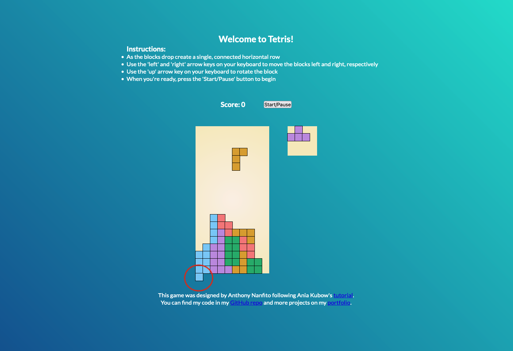

# Basic Tetris
 ## Contents
 - [About](#about)
 - [Status - WORK IN PROGRESS](#status)
   - [Project Log](#project-log)
 - [Source Attribution](#source-attribution)

 

 ## About
 A basic Tetris app built using HTML, CSS, and JavaScipt based on the [tutorial](https://youtu.be/rAUn1Lom6dw) taught by Ania Kubow. Like the well-known puzzle game, [Tetris](https://en.wikipedia.org/wiki/Tetris), this app will have the same/similar functionality as its namesake. As a kid (and an adult) I was a huge fan of playing the game so this has been an ideal project for me to work on as I continue to study front-end web development.

 ## Status
 A live version of the game can be viewed [here](https://ananfito.github.io/basic-tetris/). The app is mostly functional with a few minor glitches I still haven't worked out.

 In particular, if a vertical-like Tetromino (e.g., the `I` or `L` shaped Tetromino) falls down on the far left side of the grid it will go past the bottom edge instead of stopping. This image below dispalys what I mean.
 

 If you know how to solve this problem or would like to help, I am very open to mentorship and collaboration. Feel free to contact me via [email](mailto:ananfito@gmail.com). Thank you.

 ### Project Log
 My updates for this project can be found in the following [#100DaysOfCode](https://github.com/ananfito/100-days-of-code) Entries:
 - [September 03, 2022](https://github.com/ananfito/100-days-of-code#day-29-september-03-2022): Started working on the Tetris app
 - [September 04, 2022](https://github.com/ananfito/100-days-of-code#day-30-september-04-2022): Added functions for `freeze()`, `moveLeft()`, and `moveRight()`
 - [September 05, 2022](https://github.com/ananfito/100-days-of-code#day-31-september-05-2022): Updated `freeze()` function, organized `div` boxes, and created `displayShape()` function
 - [September 06, 2022](https://github.com/ananfito/100-days-of-code#day-32-september-06-2022): Attempted (but failed) to fix deprecated code in the `control()` function, Updated `displayShape()` function
 - [September 07, 2022](https://github.com/ananfito/100-days-of-code#day-33-september-07-2022): Added functionality to the `Start/Pause` button
 - [September 08, 2022](https://github.com/ananfito/100-days-of-code#day-34-september-08-2022): Completed the tutorial and the app works!
 - [September 12, 2022](https://github.com/ananfito/100-days-of-code#day-38-september-12-2022): Removed deprecated code from `control()` function
 - [September 13, 2022](https://github.com/ananfito/100-days-of-code#day-39-september-13-2022): Added some colors and styled the page

 You can also get updates on my progress for this project and others by following me on [Twitter](https://twitter.com/wordsbyfifi/), [Hashnode](https://ananfito.hashnode.dev/), or [GitHub](https://github.com/ananfito/).

 ## Source Attribution
 This project was created under the [MIT License](https://github.com/kubowania/Tetris-Basic#mit-licence) with permission from Ania Kubow. (Thanks Ania!) Here is the [link](https://github.com/kubowania/Tetris-Basic) to the original GitHub repo by Ania Kubow.
