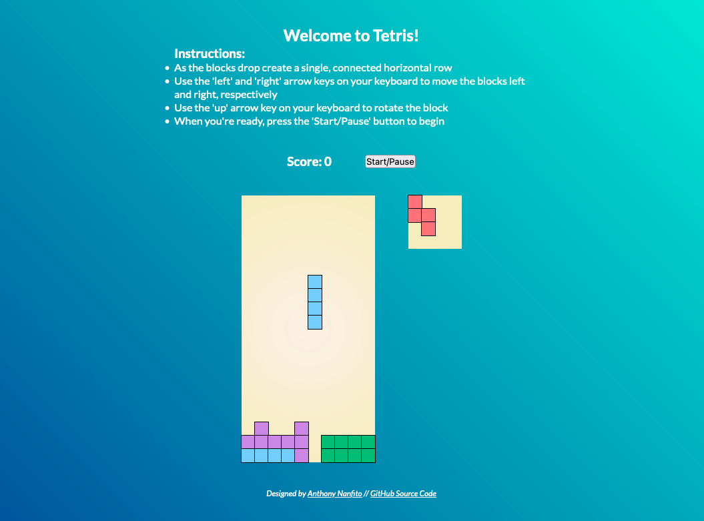

# basic-tetris
 A basic Tetris app using HTML, CSS, and JS based on the tutorial taught by Ania Kubow. A live version of the game can be viewed [here](https://ananfito.github.io/basic-tetris/)

 

 ## About
 For [my 100DaysOfCode journey](https://github.com/ananfito/100-days-of-code), I am learning how to program in JavaScript. This basic Tetris game was created by following [this "Code Tetris" tutorial](https://youtu.be/rAUn1Lom6dw) taught by [Ania Kubow](https://www.youtube.com/channel/UC5DNytAJ6_FISueUfzZCVsw) on freeCodeCamp's YouTube Channel.

 Like the well-known puzzle game [Tetris](https://en.wikipedia.org/wiki/Tetris), this app will have the same/similar functionality as its namesake. As a kid (and an adult) I was a huge fan of playing the game so this a really fun project to apply my learning.

 ## Source Attribution
Here is the link to the [original GitHub repo by Ania Kubow](https://github.com/kubowania/Tetris-Basic). This code is shared with attribution as part of the [MIT License](https://github.com/kubowania/Tetris-Basic). Thanks Ania!
